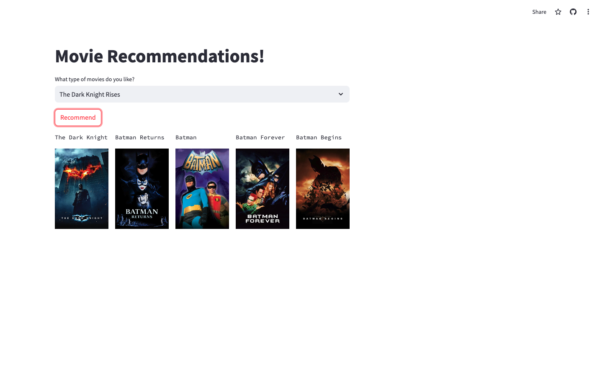

## Overview

This is a movie recommender system built using Python, Pandas, and scikit-learn. The app suggests movies based on user-selected input, providing recommendations using a similarity matrix.

The project is deployed using Streamlit, allowing users to interactively select a movie and get real-time recommendations.

## Features

- **Movie Selection**: Choose from a list of available movies.
- **Recommendations**: Get a list of movies similar to your selection.
- **Interactive UI**: Powered by Streamlit for a smooth user experience.

## Live Demo

Check out the live demo of the app [here](https://movie-recommender-x8nzxak6qh36s4c5h4fuq6.streamlit.app/).

## Screenshots

